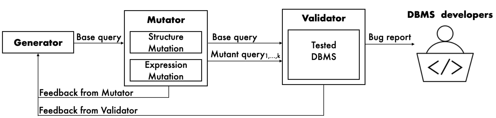

# Artifact for "Automatic Detection of Performance Bugs in Database Systems using Equivalent Queries"

The artifact consists of four main components:

1. An implementation of `AMOEBA` to find all performance bugs reported in the paper.
2. A spreadsheet named `bugs-found` containing a list of bugs that we reported and additional meta information.
3. A spreadsheet named `mutation-rules` containing a list of mutation rules that `AMOEBA` uses.
4. A spreadsheet named `SQL-features` listing SQL features that `AMOEBA` covers.


## `AMOEBA` 


`AMOEBA` is a tool that we created to automatically find performance bugs in Database Management Systems (DBMS). As stated in the `INSTALL.md` document, the easiest way to get started is the following:

```
docker pull icsesub2022/paper360:artifact
docker run --net=host -it --user postgres icsesub2022/paper360:artifact 
// after starting and attaching to the docker container, run the following commands: 
cd /workspace
eval "$(direnv hook bash)"
start_pg13.sh
start_cockroach.sh
```

At a high level, `AMOEBA` has three main components:
1. `GENERATOR` is a grammar-aware query generator that randomly generates base queries.
2. `MUTATOR` takes a base query as input and seeks to generate equivalent queries.
3. `VALIDATOR` takes a set of equivalent queries as input and generates a list of performance bug reports. It executes each pair
of equivalent queries on the target DBMS and observes whether any pair exhibits a significant difference in their runtime performance. If that is the case, it indicates the likely presence of a performance bug in the DBMS.

We implement these components in the following directories or files:
1. `GENERATOR` is implemented in `/workspace/sqlfuzz`.
2. `MUTATOR` is implemented in `/workspace/calcite-fuzzing`.
3. `VALIDATOR` is implemented in `/workspace/validator.py`.

In addition, `AMOEBA` coordinates the invocations of these three components in `/workspace/test_driver.py`.

## Run `AMOEBA` with Custom Parameters
`AMOEBA` is highly configurable, a launch command template looks like the following:
```
$timeout {total_timeout} ./test_driver.py --workers {num_workers} --output {outputfolder} --queries {num_queries_per_worker} --rewriter ./calcite-fuzzing --dbms={dbms_undertest} --validate --num_loops={num_feedbackloops} --feedback={conf_feedback} --dbconf=db_conf_demo.json --query_timeout {per_query_timeout}

```

You can customize the value of the following options:
- {total_timeout}: timeout for the entire run of `AMOEBA` (unit is seconds)
- {workers}: number of parallel workers to invoke `GENERATOR` and `MUTATOR`
- {output}: location to store the intermediate results and bug reports
- {queries}: number of base queries that are generated by each `GENERATOR` instance
- {dbms}: DBMS that `AMOEBA` will evaluate on (i.e., `postgresql` or `cockroachdb`) 
- {num_loops}: number of feedback loops
- {validate}: a boolean argument that decides whether to invoke the `VALIDATOR` after generating the equivalent query pairs
- {feedback}: what types of feedbacks to utilize (i.e., `both`, `none`, `mutator`, or `validator`)
- {query_timeout}: timeout for executing each query (unit is seconds)


For example, you can launch `AMOEBA` with the following command:

```
timeout 18000 ./test_driver.py --workers 1 --output ~/test --queries 100 --rewriter ./calcite-fuzzing --dbms=postgresql --validate --num_loops=0 --feedback=both --dbconf=db_conf_demo.json --query_timeout 10
```
If `AMOEBA` is working correctly, you should expect to see the following progress information is printed:
```
start query generator
['mutator.py --prob_table=/home/postgres/test/190156/prob_table_190156.json --db_info=/workspace/amoeba_conf/db_conf_demo.json -s seq --queries 100 1>/home/postgres/test/190156/0/log_sa0 2>/home/postgres/test/190156/0/input.sql']
finish query generator
start query rewriter
['java -cp calcite-core-1.22.0-SNAPSHOT-tests.jar:./*:. org.apache.calcite.test.Transformer /home/postgres/test/190156/0']
finish query rewriter
start validator
begin compare plan cost of equivalent queries
compare plan cost /home/postgres/test/190156/0/out/q20.sql
find plan diff /home/postgres/test/190156/0/out/q20.sql
compare plan cost /home/postgres/test/190156/0/out/q13.sql
find plan diff /home/postgres/test/190156/0/out/q13.sql
compare plan cost /home/postgres/test/190156/0/out/q18.sql
compare plan cost /home/postgres/test/190156/0/out/q23.sql
```
This command should complete within 10 minutes. You can check the generated intermediate results in `~/testexp`. If `AMOEBA` discovers potential performance bugs, the generated bug report will live at `~/testexp/bugs.md`.

The shortcut CTRL+C can be used to terminate `AMOEBA` manually. Otherwise, `AMOEBA` will terminate either after a specified experiment timeout is reached or after a specified number of base queries have been examined. The option `total_timeout` controls the experiment timeout. The options `workers`,  `queries`, and `num_loops` ultimately determine the number of base queries that `AMOEBA` is going to examine.


## List of Bugs

To provide evidence for the bugs we found, we provide a spreadsheet named `bugs-found` that contains detailed information for each bug we found, including bug characteristics reported in the paper. 

### Notable Columns in the spreadsheet

* `Classification`: This column denotes the status of the bug report, following the taxonomy that we propose in the section 3 of the paper.
* `Link`: This column provides the link to the bug report that we submitted, which shows our conversations with the developers.
* `Brief Summary`: This column provides a brief summarization of the potential performance bug.
* `Time Difference`: This column denotes the runtime performance difference of equivalent queries.


## List of Mutation Rules

We provide a spreadsheet named `mutation-rules` that contains detailed information for each rule that `AMOEBA` leverages for mutating queries. 

### Notable Columns in the spreadsheet

* `Transformation`: This column briefly summarizes the transformation that each rule performs.
* `SourceCodeLocation`: This column denotes where is the rule implemented in `MUTATOR`.


## List of SQL features

We provide a spreadsheet named `SQL-features` that denotes the SQL features that `AMOEBA` covers. 


## Using `AMOEBA` for other DBMSs

The implementation can easily be extended to test new DBMSs. To use the tool for new DBMSs, there are following things to do:
1. TODO
2.
3.
4.


